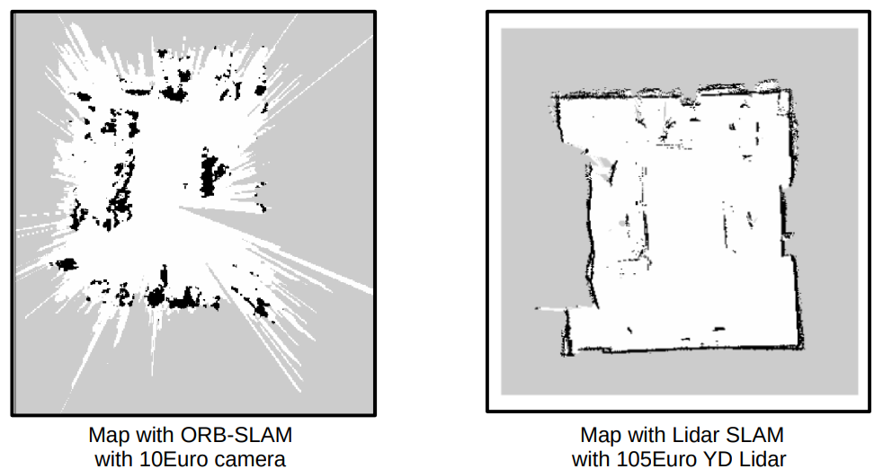
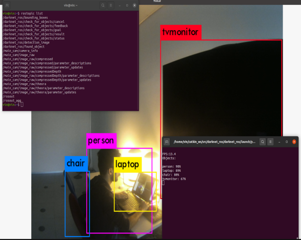
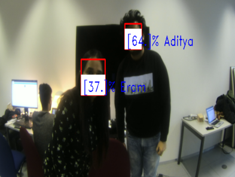

ROS doesnt works properly on Virtual Machine so the user operating system must be linux.

We have used noetic ros version on ubuntu 20.04.
The butler robot uses melodic ros version with ubuntu 18.04.

# ORB SLAM

For implementation of ORB SLAM we have used repository by aappliedAI-initiative:
link for the github repository is: https://github.com/appliedAI-Initiative/orb_slam_2_ros

git clone the repository and follow the steps given in the repository.
There is not much one has to do just git clone the repository and build the catkin_workspace.

One can refer to this webpage for creating catkin workspace
http://wiki.ros.org/catkin/Tutorials/create_a_workspace

One has to make changes in the launch file so it works for the user platform.

Steps we have done for implementation of ORB SLAM and one can do if he/she is a beginner or has no idea about it.

1. Camera calibration has to done before implementation of ORB SLAM.

	http://wiki.ros.org/camera_calibration 
	The above webpage will guide the user regarding calibration of camera.

2. In the launch file or ORB SLAM give the camera calibration parameters and the ros topic for camera using "remap" funtion.
	
   We have given the camera ros topic main_cam of robot directly in the source code i.e., MonoNode.cc
   
   Read the ORB SLAM git repository thoroughly to get idea about launch file and its parameters.
   
3. After launching the ORB SLAM launch file, we will get the ros topic for 3D point cloud data.
   
   We are using the 3D points to get occupancy grid and projected map information with help of octomap_server
 
4. Install the ros package from this url : http://wiki.ros.org/octomap_server

   Follow the steps to git clone and build the workspace.
   
5. In the launch file of the octomap_server user must provide the 3d point cloud data ros topic.
	
	After launching the lauch file it will provide necessary topics which are required further for map_server package.
	
6. Install the map_server package url : http://wiki.ros.org/map_server

   The user can run the command for saving the map and 2D map of the environment is saved in pgm format with yaml file as well.

#### Implementation with monocular camera and comparison with LIDAR Hector SLAM  

---

# YOLOv3 Object detection

We have used this repository for building object detection in butler robot

https://github.com/leggedrobotics/darknet_ros

The steps given in the repository are very clear and easy to implement.

User has to give ros image topic in the launch file and paths for different directories.

#### Implementation of YOLOv3

# Face recognition

https://github.com/jacques-saraydaryan/ros_face_recognition

The above repository has been used to implement face recognition.

The repository has all the necessary information regarding using it in ros environnment.

The python version used for this repository is old one so user has to change the syntax in the python scripts otherwise it wont work.

We have made slightly changes in the python script to get the desired output.

In the launch file user must provide the camera ros topic and requried paths of the directories.

We have given the camera ros topic direclty in the  PeopleFaceIdentification_simpl.py script.

#### CUDA installation.

The user must have CUDA installed on his/her local system as YOLO and Face recognition uses GPU for its processing.

